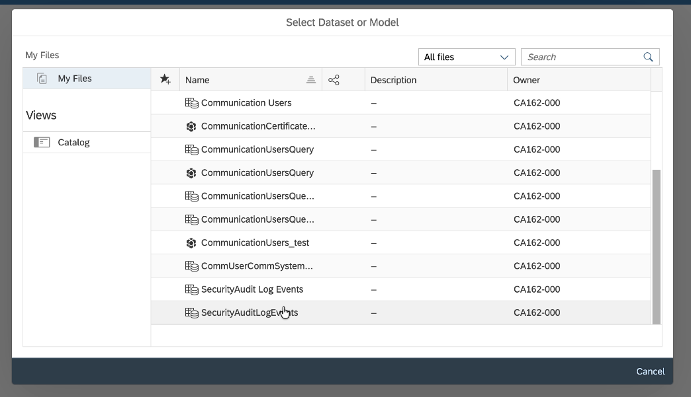
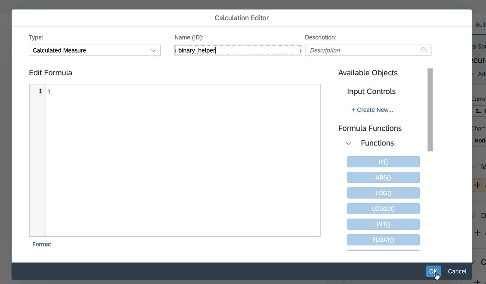
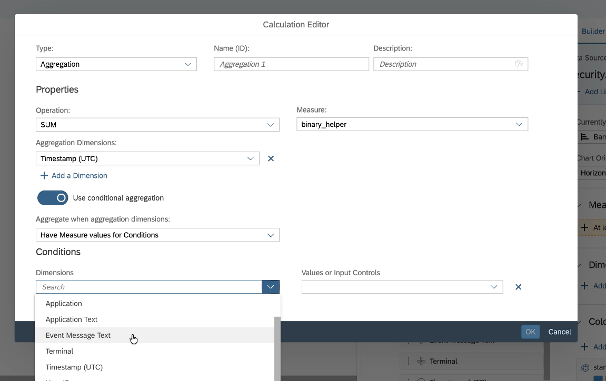
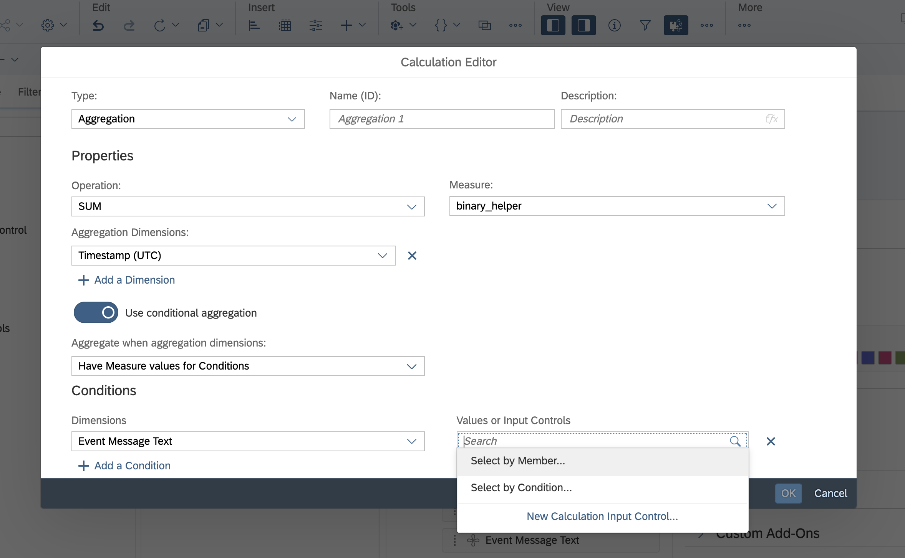
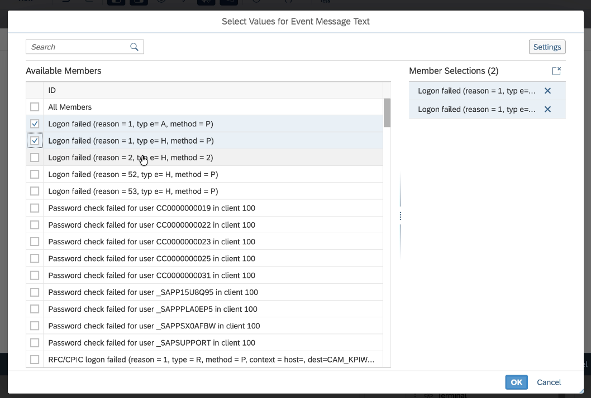
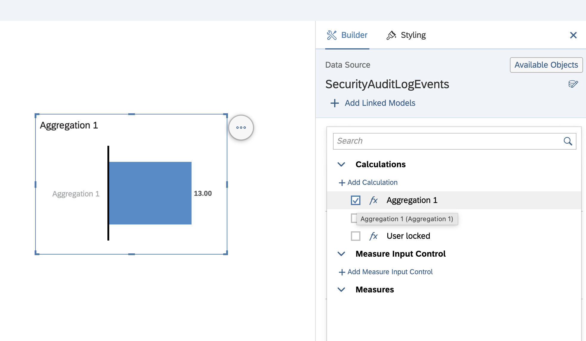
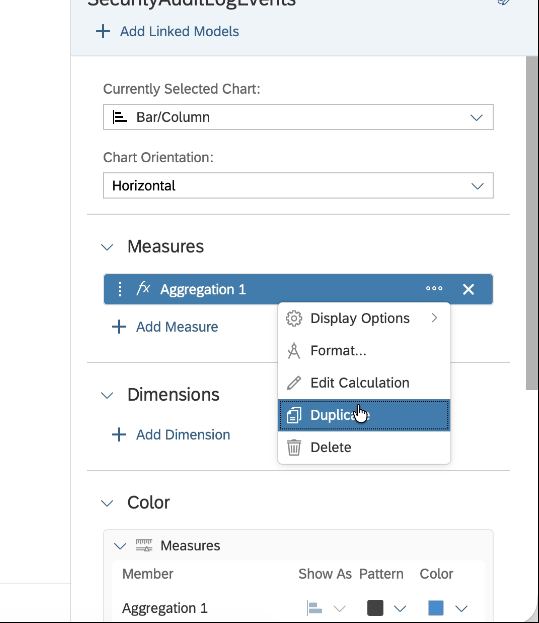
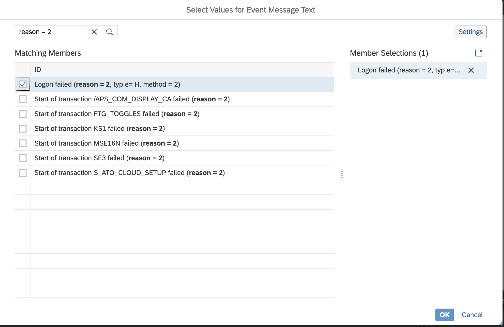
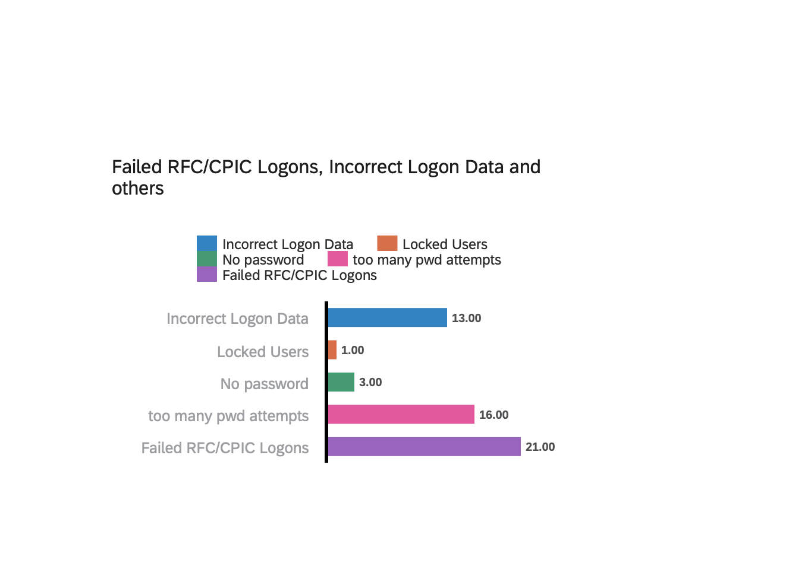

# Exercise 4: Analysis of Logon Failures (Bonus Exercise)

## Objective
In this exercise, we aim to compare the different reasons why a logon - any logon - has failed. These failed events are recorded in the **Security Audit Log**.

As a preparation, we selected and uploaded a dataset from SAP S/4HANA Cloud Public Edition, covering the period **June to end of October**, which includes the following events:
- **AU2**: Logon failed
- **AU4**: Startup transaction failed
- **AU6**: RFC CPIC logon failed
- **AU0**: Logon failed for other reasons
- **BU1**: Password check failed
- **BUD**: Late logon failed

Our goal is to **compare how often each of these failures occurred**.

## Step 4.1.: Create a Responsive Story
We start by creating a **responsive story** (as in the previous exercise) so it can be easily viewed on mobile devices.

## Step 4.2.: Add a Bar Chart
We add a **bar chart** to compare the different logon failure reasons by draging the chart onto the widget area. As before, a new window opens. The dataset is already available, so we select **SecurityAuditLogEvents**. 

## Step 4.3.: Create a Helper Measure

As in the previous exercise, we start by creating a helper measure:
- Go to **Available Objects** and add a new **Calculation**.
- Create a helper measure called **binary_helper** with the value `1`.
- Go to **Available Objects** and add a new **Calculation**.
- Create a helper measure called **binary_helper** with the value `1`.
- Confirm and close.

## Step 4.4.: Configure the Bar Chart
We want to see every failed logon, and for each failed logon there is a timestamp event. Hence, we're using the timestamp to count our failed logons. For this, we create a new calculation and choose **Aggregation**:

- Aggregate our defined **unique values** (timestamps). This gives us all failed logons. However, we want to filter by type of event, so we select the event message and apply conditions based on **Event Message Text**.
- Aggregate our defined **unique values** (timestamps). This gives us all failed logons. However, we want to filter by type of event, so we select the event message and apply conditions based on **Event Message Text**.

- Use **Select by Member** to view available members.

- Identify all entries with "reason = 1". Confirm with **OK**.

Then, in the "Measures" section of the right-hand side panel, select the aggregation you just created.

## Step 4.5.: Create Measures for Each Reason

As you can see after having created the first aggregation, this already gives us the number of failed logons with reason 1. For subsequent calculations, simply hover over the three dots of the first aggregation and select **Duplicate**.

The only change needed is the selection of members in the **Event Message Text**. Edit for:
The only change needed is the selection of members in the **Event Message Text**. Edit for:
  - Reason 2
  - Reason 52
  - Password check failed

> [!NOTE] 
> For failed logon reasons which have more than one entry, remember to select all relevant entries. See example below for Reason 2.

## Step 4.6.: Rename Measures
In our example, we duplicated the calculations without renaming them in the same step. Obviously, you can edit the name during the previous (duplicate) step. If you haven't done it then, go into every calculation again and change the names as follows. 

Rename each aggregation for clarity:
- Aggregation 1: Incorrect logon data
- Aggregation 2: User locked
- Aggregation 3: No password
- Aggregation 5: Password check failed

## Final Notes
After renaming and verifying all measures, the bar chart will clearly show the frequency of each failure reason. This provides a visual comparison of logon issues across the selected timeframe.

## Summary

After analyzing the failed logins, we will focus on securely deleting the collected data in the final [Exercise 5](../ex5/).
