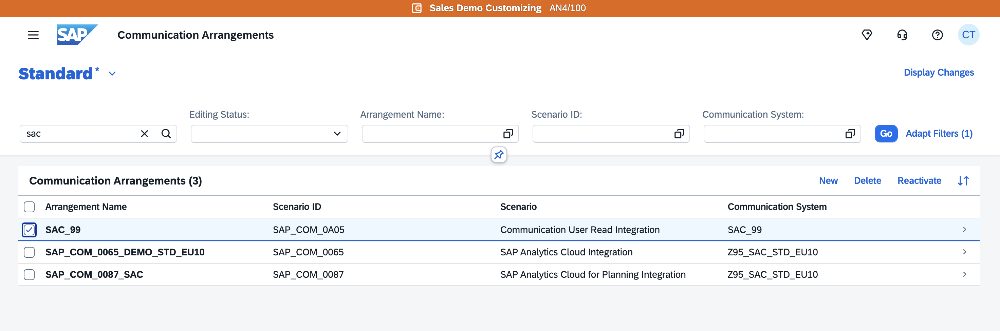

# Exercise 5: Secure Data Deletion

It is important to ensure that data retention periods are properly managed, and that data is deleted when it is no longer necessary. Therefore, this final exercise focuses on the deletion of data arrangements created in SAP S/4HANA Cloud Public Edition, as well as data imports and stories in SAP Analytics Cloud (SAC).

## Reasons for Data Deletion

Data deletion is mainly required due to:

- **Purpose limitation:** Keep data only for the specific purpose it was collected; delete it when that purpose ends.  
- **Storage limitation and data minimization (e.g., GDPR):** Retain data no longer than necessary; reduce the scope and duration of data storage to what’s required.  
- **Accuracy and relevance:** Delete outdated or inaccurate data to maintain data quality and fairness.  

## Secure Deletion of Data in SAP Analytics Cloud (SAC)

The created stories and datasets are available under **My Files** (the third icon on the left-hand side).  
By selecting all relevant stories and datasets, they can be deleted using the **trash can** icon (the sixth icon in the top-right corner).

Confirm the deletion of the data by selecting **OK**. After confirmation, the files are permanently deleted.

## Secure Deletion of Data in SAP S/4HANA Cloud Public Edition

Back in the S/4 system, search for the arrangement you created in the Communication Arrangement app and delete it. Do not delete any other arrangements, as this may affect other participants.

